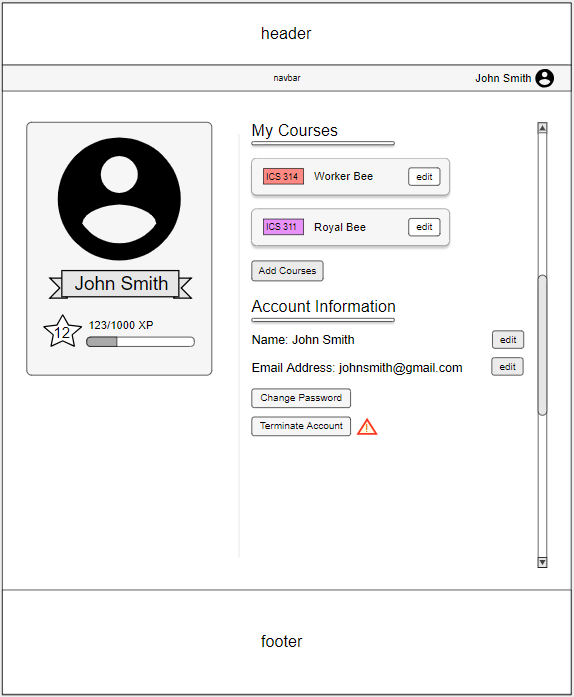

# Table of contents

* [About Waggle](#about-waggle)
  * [Key Features](#key-features)
  * [Guided Tour](#guided-tour)
* [Development history](#development-history)
  * [Milestone 1: Mockup development](#milestone-1-mockup-development)
*
* [Collaborators](#collaborators)

# About Waggle

Waggle is a Meteor application that aims to provide ICS students of UH Manoa with a platform that allows them to easily organize in-person study groups for their classes, or help other students with coursework and projects.

## Key Features

# Guided Tour

### Landing Page

Users who are logged out will find useful information about our app on the landing page. At this point, users are unable to access the key features of the app, but they do have the option to log in or register.

### User Profile Page

The user profile page is where users can view the study sessions that they have previously joined or created. Under the profile picture is the user’s level. In general, as the user attends more study sessions and is reviewed favorably by other users, the level will go up. Eventually, they will qualify as a sensei or royal bee depending on the theme.

### Create Study Session

This page allows users to create new study sessions.

### Calendar Page

The calendar page is where users can go to browse new sessions. On the right users can scroll through a list of condensed descriptions of each session. If a user wishes to see more details they may click the “show more” button. If the user wishes to join or leave a study session, then they may click the Join or Leave button. On the left, there is a calendar which displays each of the study sessions in color-coded blocks.

### Admin Page

Only admins can access the admin page, which is where they will recieve admin related notifications. Admins can also use this page to post global alerts and respond to user reports.

## Development history

## Milestone 1: Mockup development

This milestone started on April 1, 2019 and is currently a work in progress.

The goal of milestone 1 is to create a set of mock pages and decide on theming for the site.

## Collaborators

Jhun Domingo  
  
Vanessa Gerber  
  
Althea Pittman  
  
Morgan Stremick  
  
Conrad Wolfe  

