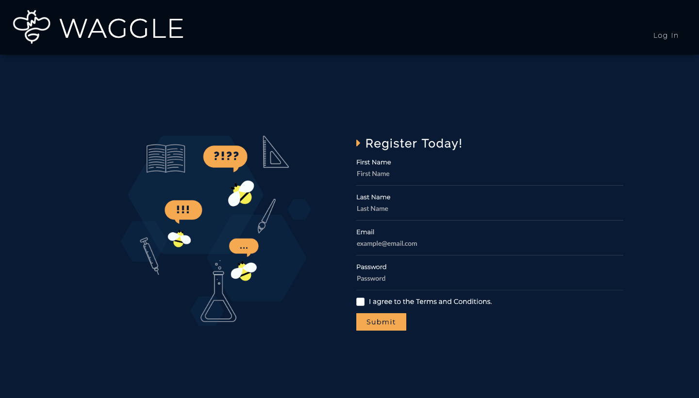
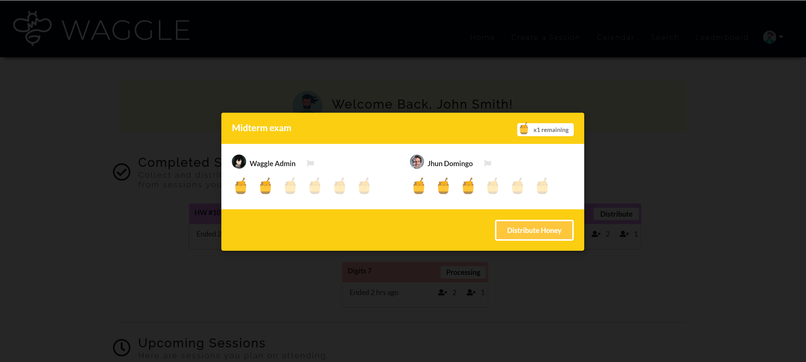
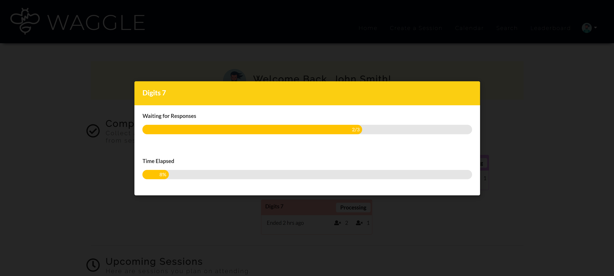
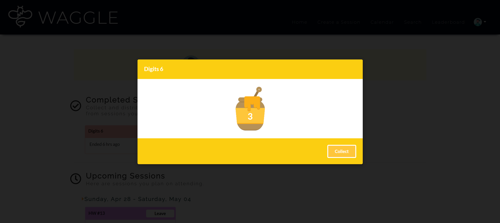
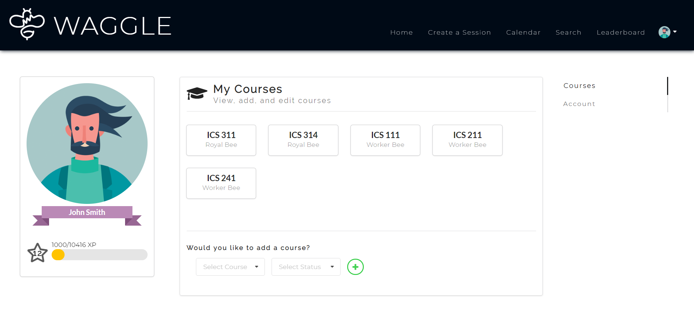
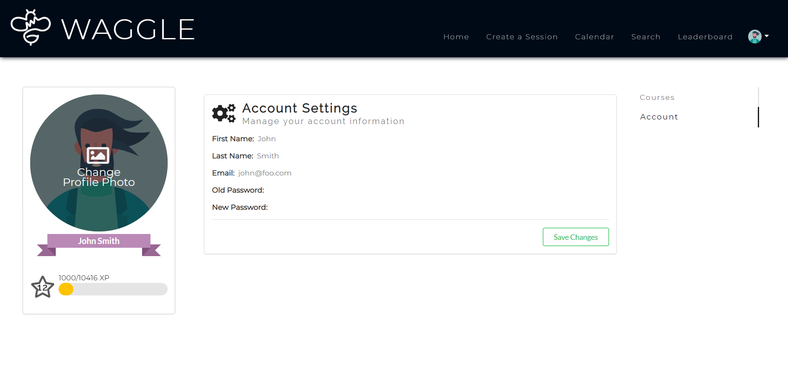
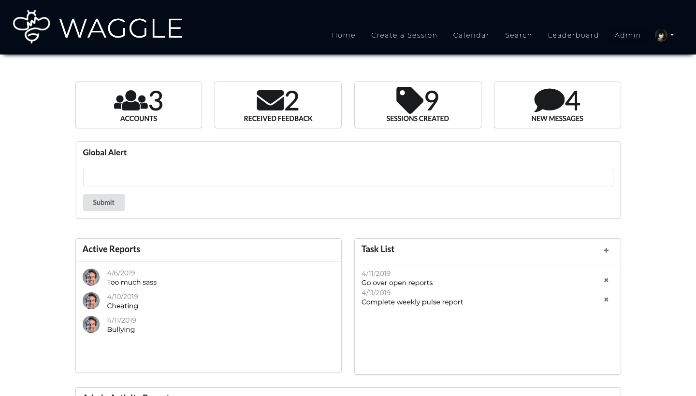
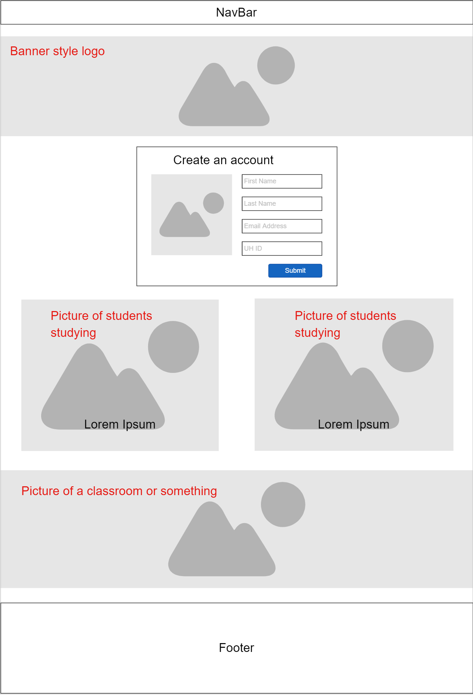
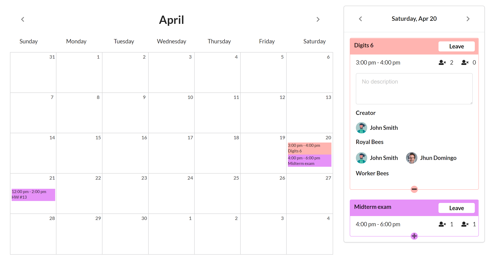
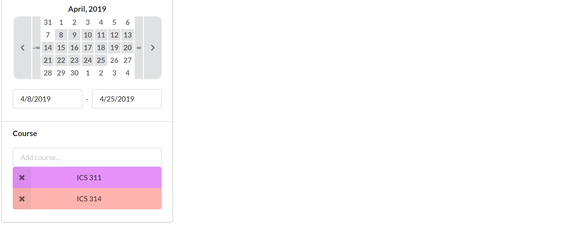

## View the live version of Waggle [here](http://waggleapp.meteorapp.com/#/)


# Table of contents

* [About Waggle](#about-waggle)
  * [Key Features](#key-features)
  * [Guided Tour](#guided-tour)
* [Developer Guide (Install)](#developer-guide)
* [Development History](#development-history)
  * [Milestone 1: Mockup Development](#milestone-1-mockup-development)
  * [Milestone 2: Functional Development](#milestone-2-functional-development)
  * [Milestone 3: Finalizing Development](#milestone-3-finalizing-development)

# About Waggle

Waggle is a Meteor application that aims to provide ICS students of UH Manoa with a platform that allows them to easily organize in-person study groups for their classes, or help other students with coursework and projects. The name Waggle is a reference to the waggle dance that honey bees use to propagate vital information about where to find food.

## Key Features

* Create profile that lists all of ICS courses that have taken as well as those that you are currently taking
* Schedule a new study session and send out notifications to intereseted users
* Browse study sessions with the calendar page
* Check your standing on the leaderboard

# Guided Tour

### Landing Page

Users who are logged out will find useful information about our app on the landing page. At this point, users are unable to access the key features of the app, but they do have the option to log in or register.




### User Homepage

When a user is logged in they are redirected to their homepage where they can view upcoming sessions and their courses.


### Distribute Honey

From the user home page, the user can view all completed session. After the end time for a joined sessions has passed, a completed session card will appear under the completed sessions header. Initially it will a display a button, which reads "Distribute" prompting the user to distribute honey to the other attenbees based on how helpful they were during the session. Users can distribute a maximum of 6 honey per session, but may distribute less if they decide to.


### Processing Honey
After the user has distributed their honey, the session card will display a button which reads "Processing". Clicking it will display two progress bars, one for the number of respondents and another for the time elapsed since the end of the session, taken out of 24 hours. The honey is done "processing" once 24 hours have elapsed since the end of the session or all of the attenbees have responded.


### Collect Honey
Once the honey is done processing, the session card will display a button reading "Collect". Clicking this button will display the amount of honey that the user has earned from the session. Since the only way for users to earn honey is by recieving it from another user, it is paramount that users have an incentive to distribute. Therefore, if the user did not distribute honey in time, they will recieve 0 honey in return. Right now, the honey is being added to the user's exp.


### User Profile Page

The user profile page is where users can view the study sessions that they have previously joined or created.




### Create Study Session

This page allows users to create new study sessions.


### Calendar Page

The calendar page is where users go to view the sessions that they have already joined. On the left is the actual calendar. By clicking on a date, the user may bring up a list of all the sessions that are scheduled for that day. Under each session is an option to show more. Clicking this button will display more information, including a description and a list of attendees. If a user so chooses they may leave a session by pressing the button located in the top right or any session card.


### Search Page

The search page is where users go to discover sessions. By manipultating various filters and sort options the user can control which results are displayed and how. On the right are the search results. Each result contains information about the title, course, time, and attenbees. If the user wants to know more about a session, they may click the plus button in the bottom right which makes the session card expand to reveal a description and a list of the attendees. The user may leave or join a session by clicking the button in the top right of each result. It is important to note that a user must add courses to their profile before they can view any sessions on the search page. Also, for ease of testing, past sessions will be displayed and they will joinable. However, if a user joins a past session, collects honey, then joins again and distributes honey, this may prevent other users from collecting honey. Were it not for the purpose of testing, the search page and the calendar page would not display past sessions.


### Admin Page

Only admins can access the admin page, which is where they will recieve admin related notifications. Admins can also use this page to post global alerts and respond to user reports.



### Leaderboard Page

View the leaderboard to see how you compare to other bees. Those who collect the most honey make it to the top.


## Developer Guide

#### Installation Instructions

1. Install [Meteor](https://www.meteor.com/install).

2. Download a copy of the [Waggle App](https://github.com/thehivemanoa/waggleapp) from our GitHub Repo. You may clone it using git.

3. In your terminal, cd into the app/ directory of your Waggle Application and install the necessary npm libraries by running the following command:

``` $ meteor npm install ```

4. Run the app with the following command:

``` $ meteor npm run start ```

The app should now be available at [http://localhost:3000](http://localhost:3000).

## Development history

### Milestone 1: Mockup Development

M1 Project Page avialable [here](https://github.com/thehivemanoa/waggleapp/projects/1)

This milestone started on April 1, 2019 and was completed on April 10, 2019.

The goal of milestone 1 was to create a set of mockup pages and decide on theming for the site. We developed webpages with minimal functionality, focusing on layout to accomodate features we plan to implement in future developments. We also had logos for the site made, and are looking into having a seperate logo made for our github organization.

#### Landing Page


#### User Profile Page


#### Create Study Session


#### Calendar Page


#### Admin Page


### Milestone 2: Functional Development

M2 Project Page avialable [here](https://github.com/thehivemanoa/waggleapp/projects/2)

This milestone started on April 10, 2019 and was completed on April 22, 2019.

The goal of milestone 2 was to improve the functionality of Waggle beyond M1. M2 has a functional calendar, search, edit profile, view upcomming sessions, and create sessions features. The functionality of these features required sufficient backend development of special APIs such as courses, sessions, and accounts.

Some UI improvements were also made to improve the quality of M1. For example, session cards display more information with view more options, search page displays more condensed card results, navbar items collapse under dropdown at certain width, and the profile page components are navigated through a side menu.

### Landing Page

Users who are logged out will find useful information about our app on the landing page. At this point, users are unable to access the key features of the app, but they do have the option to log in or register.


### User Homepage

When a user is logged in they are redirected to their homepage where they can view upcoming sessions and their courses.


### User Profile Page

The user profile page is where users can view the study sessions that they have previously joined or created.


### Create Study Session

This page allows users to create new study sessions.


### Calendar Page

The calendar page is where users go to view the sessions that they have already joined. On the left is the actual calendar. By clicking on a date, the user may bring up a list of all the sessions that are scheduled for that day. Under each session is an option to show more. Clicking this button will display more information, including a description and a list of attendees. If a user so chooses they may leave a session by pressing the button located in the top right or any session card.



### Search Page

The search page is where users go to discover sessions. By manipultating various filters and sort options the user can control which results are displayed and how. On the right are the search results. Each result contains information about the title, course, time, and attenbees. If the user wants to know more about a session, they may click the plus button in the bottom right which makes the session card expand to reveal a description and a list of the attendees. The user may leave or join a session by clicking the button in the top right of each result.




### Admin Page

Only admins can access the admin page, which is where they will recieve admin related notifications. Admins can also use this page to post global alerts and respond to user reports.

The goal of milestone 3 was to complete all functionality from M2 and add additional functionality. Some additional features include honey distribution, honey collection, adding courses, and sending global alerts from admin.

Some UI improvements were also made to improve the quality of Waggle. There is now a new and improved landing with an appriopraitely adapted navbar and the profile page contents are organized in tabs.

### Milestone 3: Finzalizing Development

M3 Project Page avialable [here](https://github.com/thehivemanoa/waggleapp/projects/3)

The goal of milestone 3 is to finalize the functionality of M2 features as well as additional functionality to the app.
Some additional features include honey distribution, honey collection, adding courses, and sending global alerts from admin.

Some UI improvements were also made to improve the quality of Waggle. There is now a new and improved landing with an appriopraitely adapted navbar and the profile page contents are organized in tabs.

See the current guided tour for screenshots from M3.

