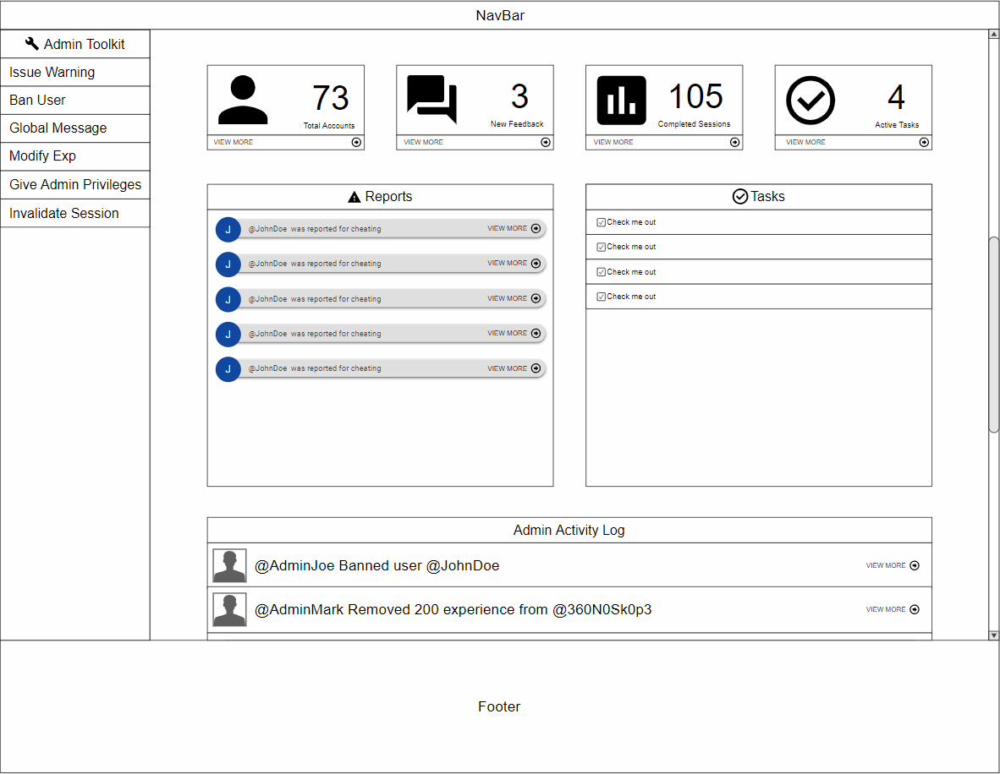

## View the live version of Waggle [here](http://waggleapp.meteorapp.com/#/)

# Table of contents

* [About Waggle](#about-waggle)
  * [Key Features](#key-features)
  * [Guided Tour](#guided-tour)
* [Development history](#development-history)
  * [Milestone 1: Mockup development](#milestone-1-mockup-development)
*
* [Collaborators](#collaborators)

# About Waggle

Waggle is a Meteor application that aims to provide ICS students of UH Manoa with a platform that allows them to easily organize in-person study groups for their classes, or help other students with coursework and projects. The name Waggle is a reference to the waggle dance that honey bees use to propagate vital information about where to find food.

## Key Features

* Create profile that lists all of ICS courses that have taken as well as those that you are currently taking
* Schedule a new study session and send out notifications to intereseted users
* Browse study sessions with the calendar page
* Check your standing on the leaderboard

# Guided Tour

### Landing Page

Users who are logged out will find useful information about our app on the landing page. At this point, users are unable to access the key features of the app, but they do have the option to log in or register.

### User Homepage

When a user is logged in they are redirected to their homepage where they can view upcoming sessions and their courses.

### User Profile Page

The user profile page is where users can view the study sessions that they have previously joined or created.

### Create Study Session

This page allows users to create new study sessions.

### Calendar Page

The calendar page is where users go to view the sessions that they have already joined. On the left is the actual calendar. By clicking on a date, the user may bring up a list of all the sessions that are scheduled for that day. Under each session is an option to show more. Clicking this button will display more information, including a description and a list of attendees. If a user so chooses they may leave a session by pressing the button located in the top right or any session card.

### Search Page

The search page is where users go to discover sessions. By manipultating various filters and sort options the user can control which results are displayed and how. On the right are the search results. Each result contains information about the title, course, time, and attenbees. If the user wants to more about a session, they may click the plus button in the bottom right which makes the session card expand to reveal a description and a list of the attendees. The user may leave or join a session by clicking the button in the top right of each result.

### Admin Page

Only admins can access the admin page, which is where they will recieve admin related notifications. Admins can also use this page to post global alerts and respond to user reports.

## Development history

## Milestone 1: Mockup development

This milestone started on April 1, 2019 and was completed on April 10, 2019.

The goal of milestone 1 was to create a set of mockup pages and decide on theming for the site. We had logos for the site made, and are looking into having a seperate logo made for our github organization.

Click to view screenshots of our original M1 mockups!

### Landing Page

### User Profile Page

### Create Study Session

### Calendar Page

### Admin Page

