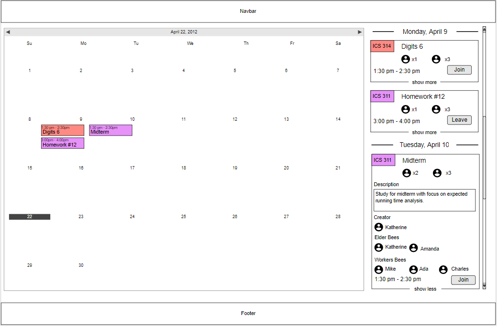

# Table of contents

* [About Waggle](#about-waggle)
  * [Key Features](#key-features)
  * [Guided Tour](#guided-tour)
* [Development history](#development-history)
  * [Milestone 1: Mockup development](#milestone-1-mockup-development)
*
* [Collaborators](#collaborators)

# About Waggle

Waggle is a Meteor application that aims to provide ICS students of UH Manoa with a platform that allows them to easily organize in-person study groups for their classes, or help other students with coursework and projects.

## Key Features

# Guided Tour

### Landing Page

### User Profile Page

### Create Study Session

### Calendar Page

The calendar page is where users can view all of the study sessions that they have joined. On left users can scroll through a list of condensed descriptions of each session. If a user wishes to see more details they may click the “show more” button. If the user wishes to leave a study session, then they may click the Leave button. On the right, there is a calendar which displays each of the study sessions in color-coded blocks.

### Admin Page

## Development history

## Milestone 1: Mockup development

This milestone started on April 1, 2019 and is currently a work in progress.

The goal of milestone 1 is to create a set of mock pages and decide on theming for the site.

## Collaborators

Jhun Domingo  
  
Vanessa Gerber  
  
Althea Pittman  
  
Morgan Stremick  
  
Conrad Wolfe  

